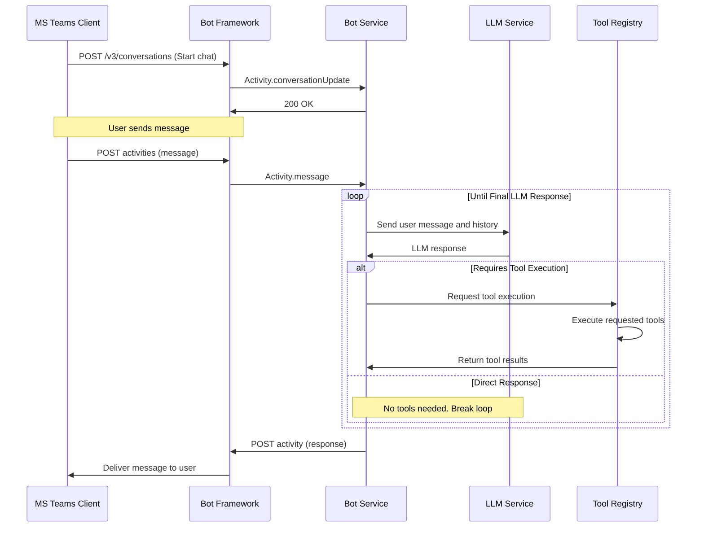
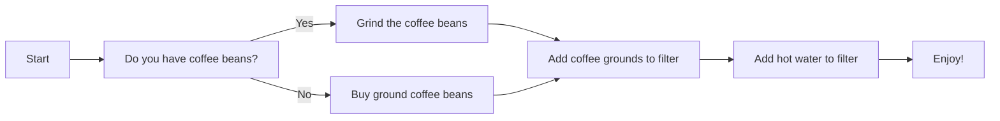
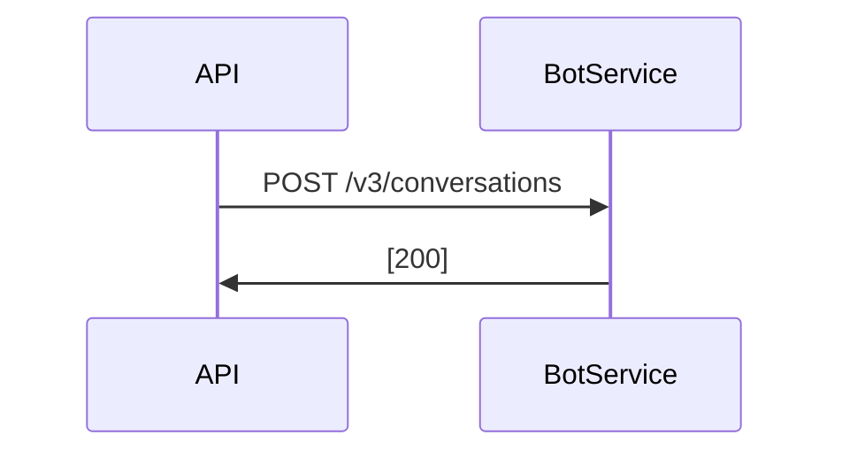

# Build a MS Teams Bot

Create a bot for MS Teams.

The Bot follows a communications protocol supported by the Azure Bot Framework


## Interaction flow

https://mermaid.js.org/syntax/sequenceDiagram.html

Start a conversation




## Overview of Bots

Bots are software applications that interact with users through text-based conversations. They can range from simple scripts to advanced AI systems that learn and adapt. In Microsoft Teams, bots can act as virtual assistants to automate tasks, provide customer support, and more.

## Types of Bots

- **Notification Bots**: Send alerts, reminders, or updates to users in Teams channels or chats.
- **Workflow Bots**: Automate and streamline business processes by managing tasks and workflows.
- **Command Bots**: Respond to simple commands using Adaptive Cards for UI.

## Bot Development Basics

- **Activity Handler**: Manages events or activities triggered by user interactions.
- **Bot Logic**: Defines decision-making rules and conditions for bot responses.
- **Bot Scope**: Determines how the bot interacts with users (e.g., personal chat, group chat, or channel).

## Development Tools

- Use the **Bot Framework SDK** or **Teams AI Library** with Teams Toolkit to build bot capabilities.
- AI-powered bots can leverage custom AI models for advanced features like natural language understanding.

## Setting Up Azure Components and Generating API Tokens

To enable the bot to interact with the Microsoft Bot Framework, you need to set up Azure components and generate API tokens. Follow these steps:

### Setup Terraform

Before you start creating the Azure components you need to install terraform

    brew install azure-cli
    az login
    brew tap hashicorp/tap
    brew install hashicorp/tap/terraform

Then you can try it out with

    make terraform-init


### 1. Register Your Bot in Azure
1. Log in to the [Azure Portal](https://portal.azure.com/).
2. Navigate to **Azure Bot Services** and create a new bot or select an existing one.
3. During the bot creation process, you will be prompted to provide the following details:
   - **Bot Handle**: A unique name for your bot.
   - **Messaging Endpoint**: The URL where your bot will receive messages (e.g., `https://<your-domain>/api/messages`).
   - **App Service Plan**: Choose a pricing tier.
4. Once the bot is created, navigate to the **Settings** page to find the **App ID** and **App Secret**.

### 2. Generate an API Token
To authenticate your bot with the Microsoft Bot Framework REST API, you need to generate an API token using the App ID and App Secret.

#### Steps to Generate a Token:
1. Use the following OAuth2 endpoint:
   - `https://login.microsoftonline.com/botframework.com/oauth2/v2.0/token`
2. Make a POST request to the endpoint with the following form data:
   ```
   grant_type=client_credentials
   client_id=<Your App ID>
   client_secret=<Your App Secret>
   scope=https://api.botframework.com/.default
   ```
3. The response will include an `access_token`. Use this token in the `Authorization` header for API requests.

#### Example Using `curl`:
```bash
curl -X POST \
  -H "Content-Type: application/x-www-form-urlencoded" \
  -d "grant_type=client_credentials" \
  -d "client_id=<Your App ID>" \
  -d "client_secret=<Your App Secret>" \
  -d "scope=https://api.botframework.com/.default" \
  https://login.microsoftonline.com/botframework.com/oauth2/v2.0/token
```

### 3. Update Your Bot Configuration
Once you have the API token, update your bot's configuration to use it for authenticated API calls. You can pass the token as a command-line argument or store it securely in an environment variable.

## References

- [Microsoft Teams Bot Overview](https://learn.microsoft.com/en-us/microsoftteams/platform/bots/what-are-bots)
- [API reference for the Bot Framework Connector service](https://learn.microsoft.com/en-us/azure/bot-service/rest-api/bot-framework-rest-connector-api-reference?view=azure-bot-service-4.0)


# Setting up local dev

Prepare a referese proxy for using with MS Teams.

## ngrok

Ngrok seems like it provides the relevant reverse proxy capabaility to project to dev laptop.

    brew install ngrok


curl --header "Content-Type: application/json" \
  --request POST \
  --header "Content-Type: application/json"  \
  --data '{"client_id":"2abf7c88-8055-4870-8b5b-8b35d6cbfcfb","client_secret":"$APP_SECRET","grant_type":"client_credentials"}' \
  https://login.microsoftonline.com/1fd80b61-a805-4a57-879b-45ddb39a660d/oauth2/v2.0/token


curl -X POST \
  -H "Content-Type: application/x-www-form-urlencoded" \
  -d "grant_type=client_credentials&client_id=2abf7c88-8055-4870-8b5b-8b35d6cbfcfb&client_secret=$APP_SECRET&scope=https://api.botframework.com/.default" \
  https://login.microsoftonline.com/1fd80b61-a805-4a57-879b-45ddb39a660d/oauth2/v2.0/token

  https://informally-large-terrier.ngrok-free.app/api/messages


# Tutorials and notes
FROM HERE: https://learn.microsoft.com/en-us/azure/bot-service/bot-service-troubleshoot-authentication-problems?view=azure-bot-service-4.0&tabs=csharp

    curl -k -X POST https://login.microsoftonline.com/botframework.com/oauth2/v2.0/token -d "grant_type=client_credentials&client_id=APP_ID&client_secret=APP_PASSWORD&scope=https%3A%2F%2Fapi.botframework.com%2F.default"

SO trying

curl -X POST -d "grant_type=client_credentials&client_id=2abf7c88-8055-4870-8b5b-8b35d6cbfcfb&client_secret=$APP_SECRET$&scope=https%3A%2F%2Fapi.botframework.com%2F.default" https://login.microsoftonline.com/1fd80b61-a805-4a57-879b-45ddb39a660d/oauth2/v2.0/token

NOW trying with new instructions:

```


```

# Curl with the APP_ID
Using the app id curl to the auth endpoint.
Can use normal tenant OR can use TENANT_ID=botframework.com

```bash
curl -X POST \
  -H "Content-Type: application/x-www-form-urlencoded" \
  -d "grant_type=client_credentials" \
  -d "client_id=${APP_ID}" \
  -d "client_secret=${CLIENT_SECRET}" \
  -d "scope=https://api.botframework.com/.default" \
  https://login.microsoftonline.com/$TENANT_ID/oauth2/v2.0/token | jq -r '.access_token'
```

# Curl with the BOT_ID
THIS does not work

```bash
curl -X POST \
  -H "Content-Type: application/x-www-form-urlencoded" \
  -d "grant_type=client_credentials" \
  -d "client_id=${BOT_ID}" \
  -d "client_secret=${CLIENT_SECRET}" \
  -d "scope=https://api.botframework.com/.default" \
  https://login.microsoftonline.com/$TENANT_ID/oauth2/v2.0/token
  ```


# Trying the botframework endpoints


```bash
curl -X POST \
  -H "Content-Type: application/x-www-form-urlencoded" \
  -d "grant_type=client_credentials" \
  -d "client_id=${APP_ID}" \
  -d "client_secret=${CLIENT_SECRET}" \
  -d "scope=https://api.botframework.com/.default" \
  https://login.microsoftonline.com/botframework.com//oauth2/v2.0/token
```

# EXTRA stuff

create an az identity

```bash
 az identity create --resource-group "bot-resource-group" --name "polecatworks-identity"
{
  "clientId": "9bc178cc-2ea6-429c-a559-6910d64839e5",
  "id": "/subscriptions/9d415cc4-075a-47ac-ba34-4328587f07ba/resourcegroups/bot-resource-group/providers/Microsoft.ManagedIdentity/userAssignedIdentities/polecatworks-identity",
  "location": "westeurope",
  "name": "polecatworks-identity",
  "principalId": "2fb044dd-f854-4c56-988a-66bd9cccc7d6",
  "resourceGroup": "bot-resource-group",
  "systemData": null,
  "tags": {},
  "tenantId": "1fd80b61-a805-4a57-879b-45ddb39a660d",
  "type": "Microsoft.ManagedIdentity/userAssignedIdentities"
}
```


# Bot Activity

Information on the bot activity: https://github.com/Microsoft/botframework-sdk/blob/main/specs/botframework-activity/botframework-activity.md
Spec of types: https://github.com/Microsoft/botframework-sdk/blob/main/specs/botframework-activity/botframework-activity.md#basic-activity-structure

Full walkthrough of registration: https://learn.microsoft.com/en-us/microsoftteams/platform/bots/how-to/authentication/add-authentication?tabs=dotnet%2Cdotnet-sample


# Curl command into the bot api


# Example removing -v and adding -s for silent progress meter:


JSON_PAYLOAD='{"id":null,"timestamp":null,"localTimestamp":null,"localTimezone":null,"serviceUrl":null,"channelId":null,"from":{"id":"polecatworks-app@4UxUYfL0I8OI8XS0VPFfXL0aJIl2Xi1vA0gestrIK91ktXV64dlfJQQJ99BDACi5YpzAArohAAABAZBS1aGL","name":"polecatworks-app"},"conversation":{"id":"4ApDY79U53qLmjG0xfSzX1-fr","name":null},"recipient":{"id":"ac2b8bda-1018-4748-8c25-3b2aadba056c","name":""},"textFormat":"plain","locale":"en-GB","text":"Hello from the bot!","attachments":[],"entities":[{"type":"ClientCapabilities","requires_bot_state":null,"supports_listening":null,"supports_tts":null}],"channelData":{"clientActivityID":"fdtv09eugi"},"replyToId":"4ApDY79U53qLmjG0xfSzX1-fr|0000000"}'


curl -s -X POST \
    -H "Authorization: Bearer ${ACCESS_TOKEN}" \
    -H "Content-Type: application/json" \
    -d "${JSON_PAYLOAD}" \
    "${API_ENDPOINT}"


# Bot Service App

Create an Azure deployment for communicating with an AI. Prepare to set this up to integrate back MS Teams.


## Flowchart of communications




## Interaction flow

https://mermaid.js.org/syntax/sequenceDiagram.html

Start a conversation



The new Message call is

    {
        "bot": {
            "id": "12345678",
            "name": "bot's name"
        },
        "isGroup": false,
        "members": [
            {
                "id": "1234abcd",
                "name": "recipient's name"
            }
        ],
        "topicName": "News Alert"
    }


# Trying the official tutorial

https://learn.microsoft.com/en-us/azure/bot-service/bot-service-quickstart-create-bot?view=azure-bot-service-4.0&tabs=python%2Cvs

# Load to Bot Emulator

    http://localhost:8080/api/messages

    http://localhost:3978/api/messages


# App token


# Working webchat token


# Working Webchat
## Generate a token (DOES NOT WORK)

##  start a conversation

## get list of conversations


## rejoin a conversation (webchat) - not working


# Working directline
##  generate a token

##  start a conversation

## rejoin a conversation (directline)


## get list of conversations


## Send an activity BROKEN
curl -v -X POST \
-H "Authorization: Bearer $CONV_TOKEN" \
-H 'Content-Type: application/json' \
-d '{
    "locale": "en-EN",
    "type": "message",
    "from": {
        "id": "Ben"
    },
    "text": "hello"
}' \
'https://europe.directline.botframework.com/v3/directline/conversations/1dwhcM1PWhh7YcOnAWecmo-eu/activities'


## Join a conversation
https://learn.microsoft.com/en-us/azure/bot-service/rest-api/bot-framework-rest-direct-line-3-0-authentication?view=azure-bot-service-4.0

When trying this i can request a token for a given conversation BUT the conversation ID for the conversation from the conversationUpdate is not found

CONVERSATION_ID=Insm4hllrx5Jo9i20EDPCI-eu
curl -X GET "https://europe.directline.botframework.com/v3/directline/conversations/${CONVERSATION_ID}" \
-H "Authorization: Bearer $TOKEN"


# Directline API


curl -v -X POST \
-H "Authorization: Bearer $CONV_TOKEN" \
-H 'Content-Type: application/json' \
-d '{
    "type": "message",
    "locale": "en-EN",
    "from": {
        "id": "user1",
        "name": "Optional User Name"
    },
    "text": "HELLO BOT"
}' \
'https://europe.directline.botframework.com/v3/conversations/1dwhcM1PWhh7YcOnAWecmo-eu/activities'


curl -X POST \
  -H 'Content-Type: application/x-www-form-urlencoded' \
  -d "grant_type=client_credentials&client_id=$APP_ID&client_secret=$TOKEN&scope=https://directline.botframework.com/.default" \
  https://login.microsoftonline.com/botframework.com/oauth2/v2.0/token


curl -X POST \
  -H 'Content-Type: application/x-www-form-urlencoded' \
  -d "grant_type=client_credentials&client_id=$APP_ID$&client_secret=$TOKEN&scope=https://directline.botframework.com/.default" \
  https://login.microsoftonline.com/botframework.com/oauth2/v2.0/token


curl -X POST \
-H "Authorization: Bearer $TOKEN" \
-H 'Content-Type: application/json' \
'https://europe.directline.botframework.com/v3/conversations'


POST https://directline.botframework.com/v3/directline/conversations
Authorization: Bearer SECRET_OR_TOKEN


# Development on K8s

Create your app secret

  kubectl create secret generic dev-chatbot -n chatbot --from-file=container-python/tests/test_data/secrets/bot/app_id --from-file=container-python/tests/test_data/secrets/bot/app_password --from-file=container-python/tests/test_data/secrets/gemini/gcp_llm_key

  kubectl create secret docker-registry dockerconfigjson-ghcr-io --docker-server=ghcr.io --docker-username=$GHCR_USERNAME --docker-password=$GHCR_TOKEN

Deploy to your local k8s using helm on the command line

  helm upgrade -i dev charts/chatbot -f charts/chatbot-values.yaml


# Useful test to validate LLM Tools

Run the following prompt to test parallel actions and chaining of tools

    please add 3 and 5 and also multiple 9 and 6. Take the results of both calculations and multiply them together.
